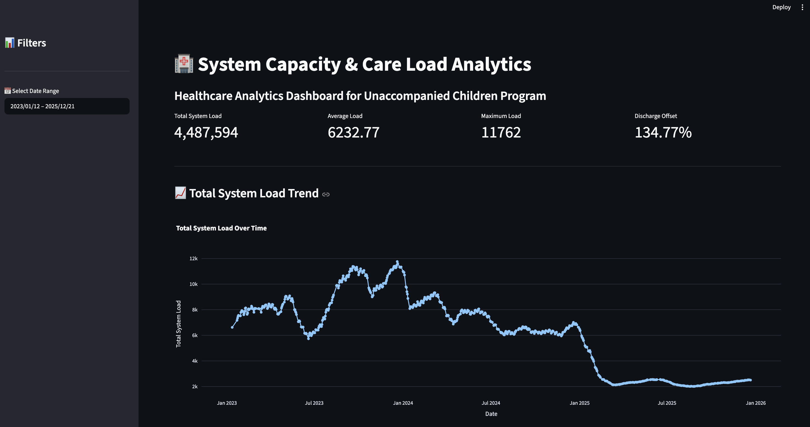
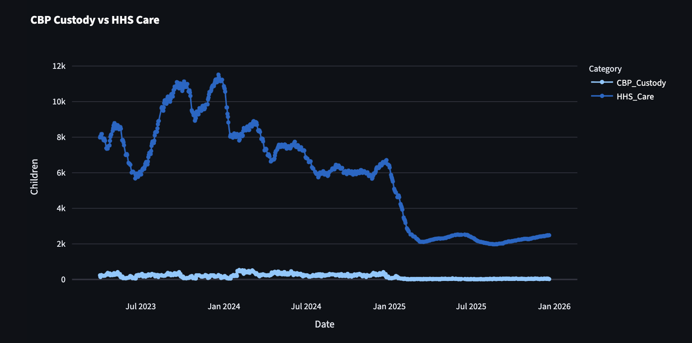
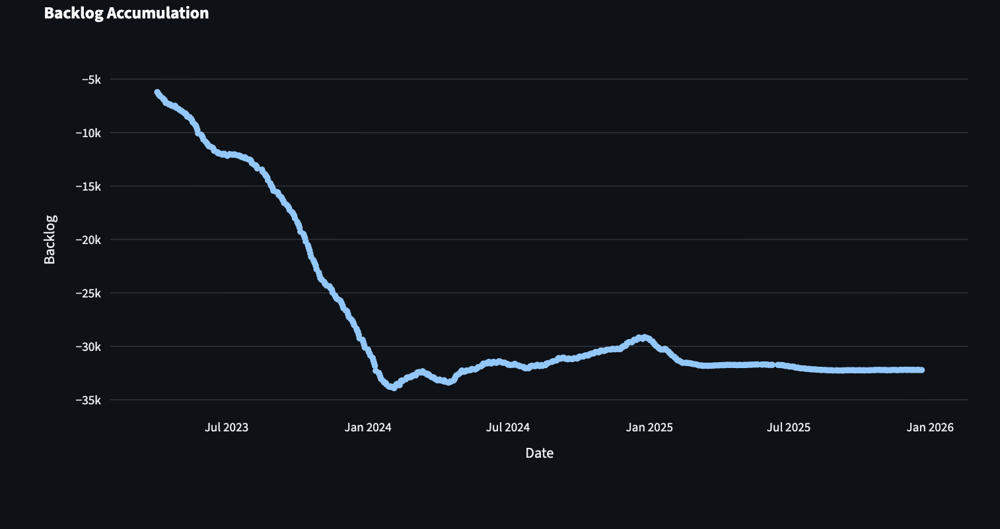
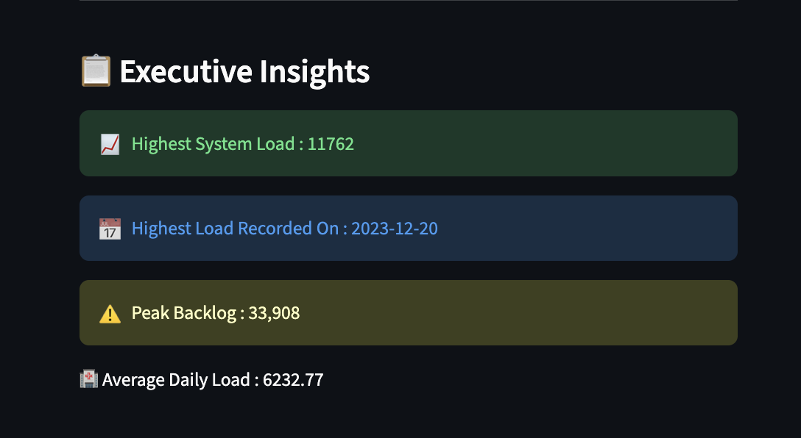

# 🏥 System Capacity & Care Load Analytics for Unaccompanied Children

## 📌 Project Overview

This project analyzes healthcare operational data from the **Unaccompanied Alien Children (UAC) Program** managed by the U.S. Department of Health and Human Services (HHS).

The objective is to monitor healthcare system capacity, analyze care load trends, evaluate intake and discharge balance, and provide decision-makers with an interactive analytics dashboard.

---

## 🎯 Objectives

### Primary Objectives
- Quantify Total System Load
- Analyze Intake vs Discharge
- Identify Capacity Stress Periods

### Secondary Objectives
- Support Healthcare Planning
- Improve Situational Awareness
- Build an Interactive Dashboard

---

## 📂 Dataset

The dataset contains daily healthcare operational records from **2023–2025**.

### Features

- Date
- Children Apprehended
- Children in CBP Custody
- Children Transferred
- Children in HHS Care
- Children Discharged

---

## ⚙️ Technologies Used

- Python
- Pandas
- NumPy
- Plotly
- Streamlit
- VS Code
- Google Colab

---

## 📊 Key Performance Indicators (KPIs)

- Total System Load
- Average Load
- Maximum Load
- Discharge Offset Ratio
- Net Intake
- Backlog
- 7-Day Rolling Average

---

## 📈 Dashboard Features

- Date Range Filter
- KPI Cards
- Total System Load Trend
- CBP vs HHS Comparison
- Net Intake Pressure
- Backlog Trend
- Rolling Average
- Monthly Load Analysis
- Executive Insights
- Dataset Preview

---

## 🚀 How to Run

### Install Dependencies

```bash
pip install -r requirements.txt
```

### Run Streamlit

```bash
streamlit run app.py
```

---

## 📷 Dashboard Preview

### 🏠 Dashboard Home



---

### 📊 CBP vs HHS Comparison



---

### 📈 Healthcare Trends



---

### 📋 Executive Insights



## 📑 Research Paper

This project also includes a research paper covering:
### 📥 Download Research Paper

[Healthcare Analytics Research Paper](Healthcare_Analytics_Research_Paper.pages)

- Introduction
- Methodology
- Exploratory Data Analysis
- Results
- Recommendations
- Conclusion

---

## 👨‍💻 Author

**Anas Ali**

B.Tech Computer Science Engineering

Healthcare Analytics Project
